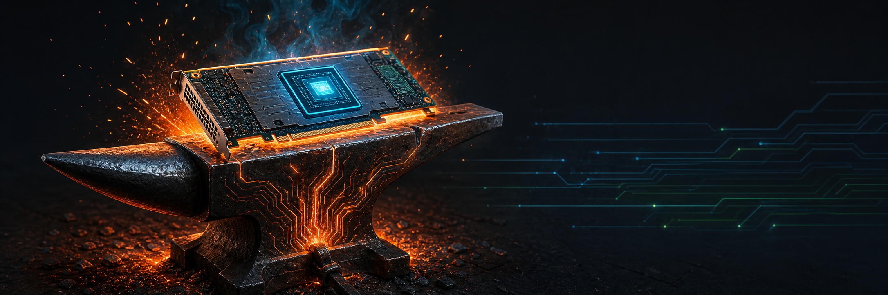

# Vitis-Anvil

A CMake project template for forging Vitis/XRT FPGA accelerators. You bring the kernel and the host code; Anvil — the iron block where hardware is forged into shape — gives you the build system, the test framework, and the deployment tooling.

If you are new here, start with the English or Chinese documentation:

- English: [README.en.md](README.en.md) · [docs/en/](docs/en/index.md)
- 中文: [README.zh.md](README.zh.md) · [docs/zh/](docs/zh/index.md)
